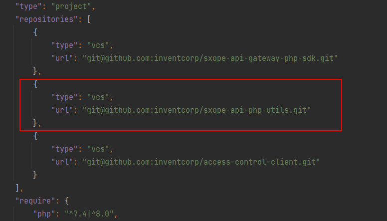

<p>
    <strong>Laravel utilities</strong>
</p>

Installation
------------
You need to add this to the `repositories` section in composer.json:

```JSON
{
    "type": "vcs",
    "url": "git@github.com:flekssk/laravel-util.git"
}
```

<details>
  <summary>Example</summary>



</details>


Execute next command from the root project:
```BASH
deployment/scripts/local/composer.sh require flekssk/laravel-util:v1.0.0
```
Or: 
```BASH
composer require flekssk/laravel-util:v1.0.0
```

Important: `v1.0.0` change to fresh release.

Documentation
------------

[Search Component](docs/search-component.md)

[Swagger attributes](docs/swagger-attributes.md)

[Metadata](docs/FKS-metadata.md)

Contributing
------------
Contributions are welcome! Create issues and pull requests.

