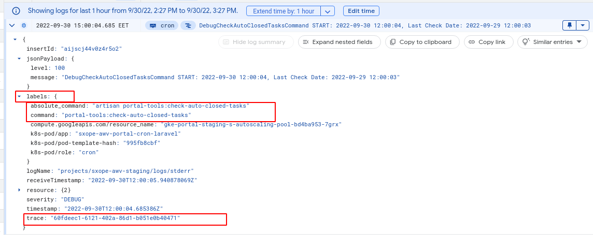

# Logging

## Responsibility

Log messages that are compatible with Google Kubernetes Engine (GKE).

## Motivation to use

- More expressive messages.
- Ability to filter by additional meta information.
- Possibility of tracking thanks to `traceId` the execution of distributed work by jobs.



## Settings

### Settings in config/logging.php

```PHP
<?php

return [
    'default' => env('LOG_CHANNEL'),
    'deprecations' => env('LOG_DEPRECATIONS_CHANNEL', 'null'),
    'channels' => [
        'gke-log' => [
            'driver' => 'custom',
            'via' => \FKS\Logging\Factory::class,
        ],
        //*** OTHER CHANNELS ***
    ],

];

```

### Settings in files env.staging and env.production in the root directory of project

```ENV
LOG_CHANNEL=gke-log
```

### Need register the service provider

`\FKS\Providers\LogServiceProvider`

## Usage

Once configured, this logger will collect more information about a context in which a log message was created.

But the logger offers more options for gathering data about a context in which a log message was created.

### 1. Creation a log message using exists features from the box
```PHP
logger()->debug('example message', ['labels' => ['label_1' => 'value_1', 'label_2' => 'value_2']]);
```

### 2. Using Facade `FKS\Facades\FKSLogger` (need apply service provider)

```PHP
<?php

declare(strict_types=1);

namespace App\Services\Example;

use FKS\ValueObjects\Id;
use FKS\Facades\FKSLogger;

class ExampleClass
{
    public function update(Id $id)
    {
        FKSLogger::emergency('message 1', ['context_message' => 'context_message_value'], ['label' => 'label_value']);
        FKSLogger::alert('message 2', ['context_message' => 'context_message_value'], ['label' => 'label_value']);
        FKSLogger::error('message 3', ['context_message' => 'context_message_value'], ['label' => 'label_value']);
        FKSLogger::emergency('message 4', ['context_message' => 'context_message_value'], ['label' => 'label_value']);
        FKSLogger::debug('message 5', ['context_message' => 'context_message_value'], ['label' => 'label_value']);
        
        //Example 1
        //check performance
        FKSLogger::beginProfile($token = 'Name of work. Example 1');
        //hard work
        FKSLogger::endProfile($token);
        
        //Example 2
        //check performance
        FKSLogger::beginProfile($token = 'Name of work. Example 2', ['labels' => ['label_1' => 'value_1'], 'other_context_info' => 'value']);
        //hard work
        FKSLogger::endProfile($token);
    }
    
    public function update2(Id $id)
    {
        FKSLogger::addLabels([
            'action_type' => 'pubsub',
            'action' => 'pubsub.resend_message',
        ]);  
        
        //next all log messages will be created with above labels settings
        FKSLogger::alert('message 1');
        FKSLogger::error('message 2');
    }
}

```
